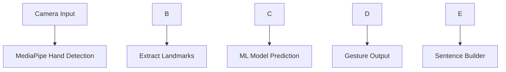

\# 🤟 AI Sign Language Interpreter


\### 🚀 Real-Time Gesture Recognition • Multi-Language Output • Smart UI


!\[Python](https://img.shields.io/badge/Python-3.10-blue?style=for-the-badge\\\&logo=python)

!\[OpenCV](https://img.shields.io/badge/OpenCV-Computer%20Vision-green?style=for-the-badge\\\&logo=opencv)

!\[MediaPipe](https://img.shields.io/badge/MediaPipe-Hand%20Tracking-orange?style=for-the-badge)

!\[Status](https://img.shields.io/badge/Status-Working-success?style=for-the-badge)


\---


\## 🧠 About The Project


This project is a \*\*real-time AI-powered sign language interpreter\*\* that detects hand gestures using computer vision and converts them into meaningful text and sentences.


Designed to \*\*bridge the communication gap\*\* for deaf and mute individuals, the system focuses on \*\*speed, accuracy, and usability\*\* with a modern UI.


\---


\## ⚡ Key Features


✨ Live camera gesture detection

✨ Real-time hand tracking (21 keypoints)

✨ Custom-trained ML model

✨ Sentence builder with smooth UI

✨ Multi-language support:


\* 🇬🇧 English

\* 🇮🇳 Hindi

\* 🇮🇳 Marathi

\* 🇮🇳 Bengali


✨ Clean, resizable, modern interface


\---


\## 🎥 Demo


> 📌 Add your screenshot below


```md

!\[Demo](assets/demo.png)

```


\---


\## 🏗️ How It Works





\---


\## 🛠️ Tech Stack


| Technology   | Purpose                   |

| ------------ | ------------------------- |

| Python       | Core Programming          |

| OpenCV       | Camera \& Image Processing |

| MediaPipe    | Hand Tracking             |

| NumPy        | Data Processing           |

| Scikit-learn | Model Training            |

| PIL          | UI Text Rendering         |


\---


\## 📂 Project Structure


```

sign-language-app/

│

├── main.py          # Main application

├── collect.py       # Data collection

├── train.py         # Model training

├── model.pkl        # Trained model

├── labels.pkl       # Label mapping

├── data/            # Dataset

├── fonts/           # Multi-language fonts

├── README.md

├── .gitignore

```


\---


\## ▶️ How to Run


```bash

\# Activate environment

isl\_env\\Scripts\\activate


\# Run app

python main.py

```


\---


\## 🧪 Training the Model


```bash

python collect.py   # Collect gesture data

python train.py     # Train model

```


\---


\## 🎯 Use Cases


\* Assistive communication tool

\* Educational projects

\* Accessibility solutions

\* Real-time translation systems


\---


\## 🔮 Future Enhancements


🚀 Voice output (Text-to-Speech)

🚀 Deep learning (CNN/LSTM) upgrade

🚀 Mobile app version

🚀 Cloud deployment

🚀 Full ISL gesture support


\---


\## 👨‍💻 Author


\*\*Vishnu Bhrigu\*\*

BTech CSE Student


\---


\## ⭐ Show Some Love


If you found this project useful:


👉 Star the repo

👉 Share with others

👉 Build upon it


\---


\## 💬 Final Thought


> "Technology should not just be powerful — it should be inclusive."


\---


