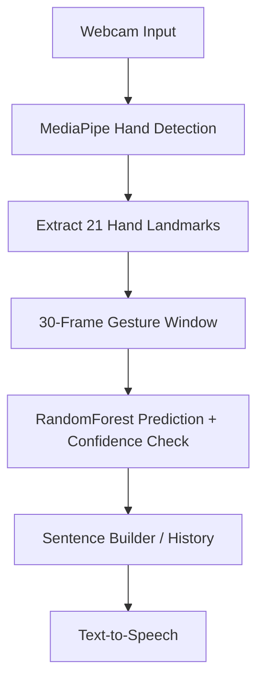

# 🤟 SignSpeak — AI Sign Language Interpreter

### Real-Time Gesture Recognition • Multi-Language Output • Voice Feedback


---

## 🧠 About The Project

**SignSpeak** is a real-time AI-powered Indian Sign Language (ISL) interpreter. It watches your hand through a webcam, recognizes the gesture with a machine-learning model, builds it into a sentence, speaks it aloud, and can display it in English, Hindi, Bengali or Tamil — with correct native script rendering.

Designed to **bridge the communication gap** for deaf and mute individuals, the system focuses on real-time responsiveness, multi-language accessibility, and a clean, modern desktop interface.

---

## ⚡ Key Features

- 🎥 Live webcam gesture detection with MediaPipe hand tracking (21 landmarks)
- 🌳 Custom-trained RandomForest classifier over 30-frame gesture sequences
- 🧠 Confidence-gated predictions — the model only accepts a gesture once its probability clears a threshold and stays stable across frames, so an empty frame or the wrong hand pose doesn't fire false positives
- 📝 Sentence builder that appends recognized words with a flash-highlight animation
- 🕒 Timestamped gesture history log
- 🌐 Multi-language output: **English, Hindi, Bengali, Tamil**, rendered with Pillow (not `cv2.putText`, which can't shape Devanagari/Bengali/Tamil script)
- 🔊 Text-to-speech via `pyttsx3`, spoken in the selected language when a matching voice is installed, with an English fallback otherwise
- 🎨 Modern dark desktop UI built with CustomTkinter — Inter typography, a single teal accent color, rounded cards, animated confidence meter, hover/press feedback on buttons
- 🖥️ Native desktop window (CustomTkinter) instead of a raw OpenCV display window

---

## 🤟 Recognized Signs

Currently trained and recognized: **Hello, Yes, No, Thanks, I Love You, Good**

Also collected (data recorded, not yet in the active model): Please, Sorry, Help, Stop, Water, Food — see [Training More Signs](#-training-more-signs-collectpy--trainpy) to enable them.

---

## 🏗️ How It Works



---

## 🛠️ Tech Stack

| Technology       | Purpose                                  |
| ----------------- | ----------------------------------------- |
| Python            | Core programming                          |
| OpenCV            | Webcam capture & image processing         |
| MediaPipe         | Hand landmark tracking                    |
| NumPy             | Numeric data processing                   |
| Scikit-learn      | RandomForest model training               |
| CustomTkinter     | Desktop UI framework                      |
| Pillow (PIL)      | Devanagari/Bengali/Tamil text rendering   |
| pyttsx3           | Offline text-to-speech                    |

---

## 📂 Project Structure

```
sign-language-app/
├── main.py              # Desktop app: UI, prediction loop, TTS
├── collect.py           # Records webcam gesture sequences into data/
├── train.py             # Trains the RandomForest model from data/
├── model.pkl            # Trained classifier
├── labels.pkl           # Class label order
├── requirements.txt     # Python dependencies
├── data/                # Recorded per-gesture keypoint sequences
├── fonts/               # Bundled Devanagari/Bengali font + Inter typeface
├── app_icon.ico          # Generated app icon
└── README.md
```

---

## ▶️ How to Run

```cmd
cd sign-language-app
isl_env\Scripts\activate
pip install -r requirements.txt
python main.py
```

A window opens with the webcam feed on one side and a sidebar (language selector, current prediction, confidence meter, sentence builder, history log) on the other.

---

## 🧪 Training More Signs

1. **Collect data** — edit the `actions` list in `collect.py` to the signs you want, then run it. It walks you through recording 20 sequences × 30 frames per sign via webcam.

   ```cmd
   python collect.py
   ```

2. **Retrain** — edit the `actions` list in `train.py` to match the signs you want in the active model, then run:

   ```cmd
   python train.py
   ```

   This rebuilds `model.pkl` / `labels.pkl`, which `main.py` loads on startup.

---

## 🎯 Use Cases

- Assistive communication tool
- Educational / accessibility projects
- Real-time gesture-to-speech translation demos

---

## 🔮 Future Enhancements

- 🚀 Deep learning (CNN/LSTM) upgrade for larger vocabularies
- 🚀 Two-handed and dynamic (motion-based) ISL signs
- 🚀 Mobile app version
- 🚀 Cloud deployment

---

## 👨‍💻 Author

**Vishnu Bhrigu**
BTech CSE Student

---

## 💬 Final Thought

> "Technology should not just be powerful — it should be inclusive."
